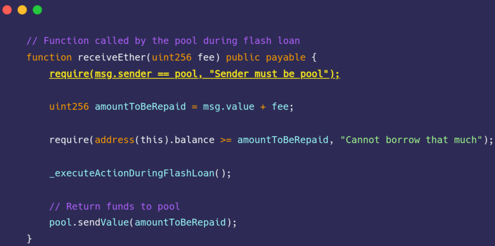
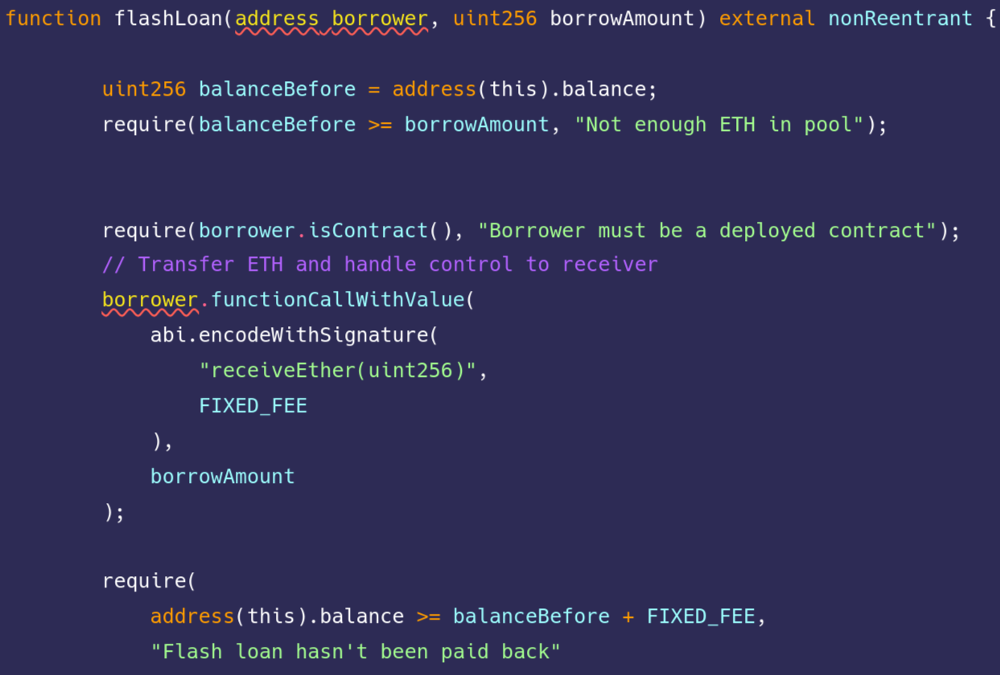
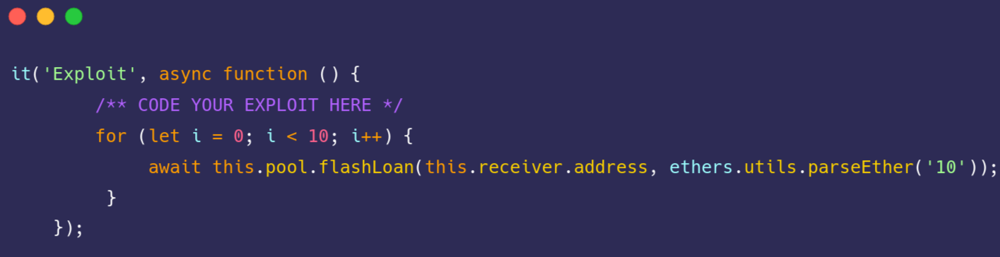

## What are the smart contracts 
- **NaiveReceiverLenderPool.sol** 
- **FlashLoanReceiver.sol** 

## What is our mission
There's a lending pool offering quite expensive flash loans of Ether, which has 1000 ETH in balance.

You also see that a user has deployed a contract with 10 ETH in balance, capable of interacting with the lending pool and receiveing flash loans of ETH.

Drain all ETH funds from the user's contract.

## Solution 

1. Here **receiveEther** function of **FlashLoanReceiver.sol**
 

2. As you can see only pool can call **receiveEther** funtion
 

So we cant send any transection to **FlashLoanReceiver.sol** 

3. Here **flashLoan** function of **NaiveReceiverLenderPool.sol**
 

Contact gets the repayment from **address borrower** but anybody can call **flashLoan** function of **NaiveReceiverLenderPool.sol** with any **address borrower** paramether

So the solution is just calling **flashLoan** function with **address borrower == receivers address** from any kind of account, until all ETH funds in the user's contract is gone.

   

So put this code to **test/naive-receiver/naive-receiver.challenge.js** exploit function
 

## How to test it
got to ➡️ [Damn Vulnerable Defi - Chalange #2](https://www.damnvulnerabledefi.xyz/challenges/2.html). Clone their repository as mentioned and put solution code to his place.

Then you can just type `yarn run naive-receiver`

